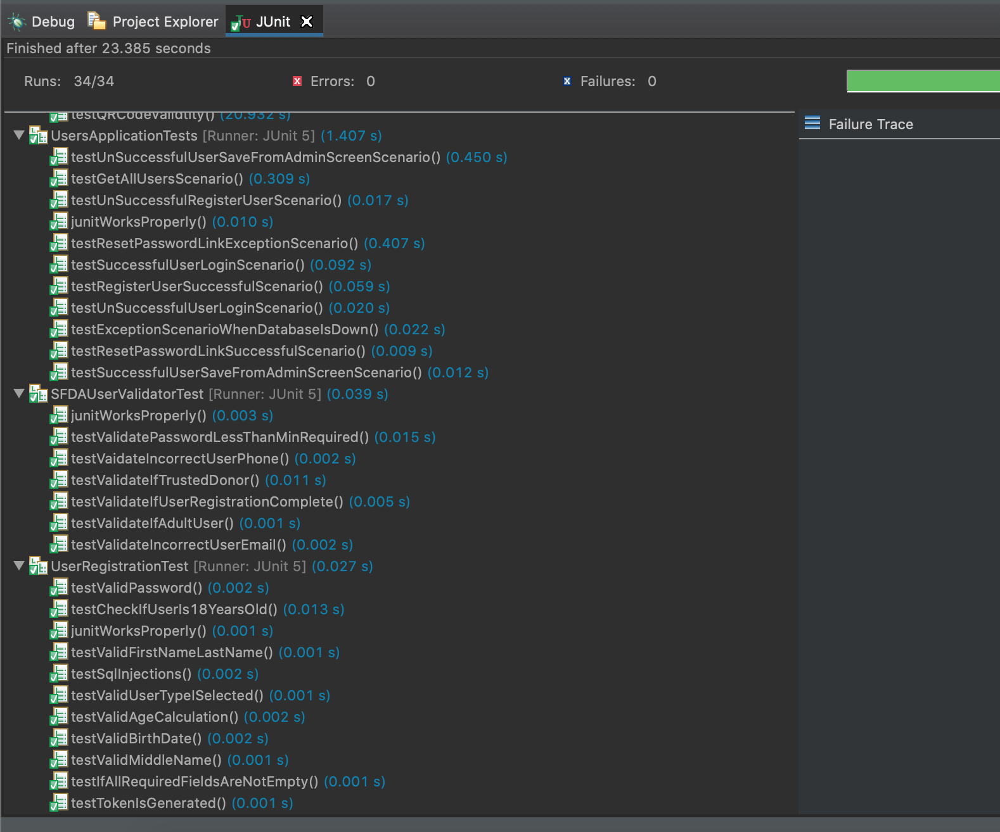

# Xtream Team
# README - Sprint 3

### Project Name: Secure Food Distribution App

### Team Members 
- **Prashant More**: Product Owner / Developer
- **Alexander Giannini**: Scrum Master/ Developer
- **Juan Valladares**: Developer
- **Anup Shetye**: Developer
- **Manav Agarwal**: Developer

#### Project URL: [http://54.219.4.96:8080/](http://54.219.4.96:8080/)
#### Username: test@test.com
#### Password: test

## 12/1 Sprint Planning

#### RUBRIC: You have a forecast of how many story points your team can complete during the sprint. The forecast is documented in your README

###### We forecast that we will complete 50 story points.

#### RUBRIC: Your rationale for your forecast is documented in your README

###### In Sprint 1, we estimated 75 but were unable to get close to our goal. In Sprint 2, we estimated 50 and that was closer to our actual velocity. For Sprint 3, we will have the approximately the same amount of time to work as sprint 2, and so are forecasting 50 story points. 

#### RUBRIC: You pulled stories into your sprint backlog. You pulled stories from the top of your product backlog. The aggregate size of the stories does not exceed your forecast. Development Team members participated in this activity (and in your project README, you made a statement or provided evidence that only Development Team members participated in this activity). (1 point for each item)

###### We pulled four User Stories into our Backlog. The aggregate size of the stories is 47, which is less than our forecast. Only development team members participated in this activity.

#### RUBRIC: All of the stories in your sprint backlog are the right size: the size of each backlog item is less than half your forecast velocity for the sprint. If you noticed PBIs that are too large to get done in a sprint, you refined them by splitting them into smaller stories and estimating the smaller stories

###### There are no user stories in our Backlog that are greater than half of the forecast velocity. We did take some time to analyze the backlog and modified the order and the Security PBI. For this sprint we have 4 PBI. They include:

###### Sign Up Functionality for Recipients – 13 Story Points
###### User Story: As a charity recipient, I want to be able to sign up so I can start receiving help.
###### Acceptance Criteria: Recipients can register via a form.

###### Donor Profile Creation - 13 Story Points 
###### User Story: As a donor, I want to be able to sign up so I can start donating money.
###### Acceptance Criteria: Donor can register via a form.

###### Contact Page - 8 Story Points 
###### User Story: As an app user, I need to be able to contact someone if there are any issues
###### Acceptance Criteria: App user can send automatic email via contact form page on site.

###### Secure Website – 13 Story Points
###### User Story: As an app user, I want the applciation to be secure so I can safely use it.
###### Acceptance Criteria: https and domain name registration.

#### You decomposed user stories into developer tasks (1 point). The tasks are clearly listed in your sprint backlog (1 point

###### We decomposed our user stories into developer tasks. They are listed in our sprint backlog and can be found on our [Kanban Board]( https://xtremeteam3.atlassian.net/secure/RapidBoard.jspa?rapidView=1&projectKey=SFDA&selectedIssue=SFDA-3). 

###### Your sprint backlog, including both the user stories and developer tasks, is represented in a kanban board (1 point). The URL of the kanban board is documented in your README (1 point). Course staff can view the kanban board (1 point).

#### our Kanban board can be found at https://xtremeteam3.atlassian.net/secure/RapidBoard.jspa?rapidView=1&projectKey=SFDA&selectedIssue=SFDA-3

###### RUBRIC: You have a sprint burndown chart. On the x-axis, you display time markers in units of 1 day. On the y-axis, you display story points remaining to get done. There is a linear curve descending from left to right; the leftmost point of the curve is number of story points in your sprint at sprint day 1; the rightmost point is 0 story points remaining on the last day of the sprint. The burndown chart, or the URL of the burndown chart, is document in your README. Course staff can view the burndown chart. (1 point for each sentence you complete)

#### For our Sprint Burndown Chart we used an excel spreadsheet adapted from a template that we found a website called coria.com (Full URL: https://www.coria.com/insights/blog/project-management/how-to-create-a-burndown-chart-in-excel). The a pdf title Sprint3_Burdown is located in the Repo. Also, a picture is attached:

#### RUBRIC: Daily Scrum: You have conducted multiple Daily Scrums. You document evidence of at least one daily scrum in your README your daily scrums, you discussed: what did you do in the last 24 hours that helped the Development Team meet the Sprint Goal? In your README, document which team members did which activities. (1 point for each team member&#39;s response, up to a maximum of 5 points)

#### RUBRIC: In your daily scrums, you discussed: what will you do in the next 24 hours to help the Development Team meet the Sprint Goal? In your README, document which team members plan to do which activities. (1 point for each team member&#39;s response, up to a maximum of 5 points

#### RUBRIC: In your daily scrums, you discussed: do you see any impediment that prevents you or the Development Team from meeting the Sprint Goal? What are the impediments? What is your impediment removal plan? (1 point for each question answered)

###### Notes from our Daily Scrums can be found at the bottom of this document. We discussed our impediments, what we had done in the previous 24 Hours, and what we were planning to do in the next 24 hours.

#### RUBRIC: Every day during the sprint, update your sprint task board and burndown chart. Provide evidence (URLs or images) in your README to show that you did this. (1 point for each time you updated your tracking indicators, up to a maximum of 2 points)

###### When we met, we did our best to update our task list and burndown chart with any relevant items. We have included four pictures: Before and After of our Kanban Board and Before and after of our Burndown Chart.

#### RUBRIC: Pair- or Mob-Programming: There is evidence that you paired or mobbed on your code. The evidence could be a photo or video of your team working together, or it could be some other kind of evidence. The evidence is included in your README. (1 point for each team member who participated, up to a maximum of 5 points)

###### We completed our second PBI (user registration) during a mob programming session. For evidence, we have included pictures of our zoom session.

#### RUBRIC: Test-Driven Development: There is evidence that you are building your product test-first. There is at least 1 BDD/A-TDD test in your test suite, and it passes. There are at least 30 micro-scale unit tests in your test suite, and they all pass. (1 point for the BDD test. 1 point for each *new* unit test that you created in this sprint, up to a maximum of 10 points

###### After this sprint, our application contains over 30 tests. We did our best to write our micro tests before all coding. Our tests are in five separate files (listed below). Here is a picture of our tests all passing.

##### BDD Test
###### For our BDD test we are using a BDD testing framework called [Spock]( http://spockframework.org/spock/docs/1.3/index.html) . It is very similar to Cucumber. Spock uses JUNIT to run BDD tests. Our initial BDD test will test the login modal, specifically whether registration is successful and the modal disappears after a successful login. Our BDD test can be found at the first link below.

###### [https://github.com/jcvalladares/xtreamteam/blob/main/sfda/src/test/groovy/com/sfda/test/SfdaBehaviroalTest.groovy](https://github.com/jcvalladares/xtreamteam/blob/main/sfda/src/test/groovy/com/sfda/test/SfdaBehaviroalTest.groovy)

##### Other Tests

###### [https://github.com/jcvalladares/xtreamteam/blob/main/sfda/src/test/java/com/sfda/users/UsersApplicationTests.java](https://github.com/jcvalladares/xtreamteam/blob/main/sfda/src/test/java/com/sfda/users/UsersApplicationTests.java)

###### [https://github.com/jcvalladares/xtreamteam/blob/main/sfda/src/test/java/com/sfda/users/SFDAUserValidatorTest.java](https://github.com/jcvalladares/xtreamteam/blob/main/sfda/src/test/java/com/sfda/users/SFDAUserValidatorTest.java)

###### [https://github.com/jcvalladares/xtreamteam/blob/main/sfda/src/test/java/com/sfda/util/QRCodeGeneratorTest.java](https://github.com/jcvalladares/xtreamteam/blob/main/sfda/src/test/java/com/sfda/util/QRCodeGeneratorTest.java)

[https://github.com/jcvalladares/xtreamteam/blob/main/sfda/src/test/java/com/sfda/users/UserRegistrationTest.java]( https://github.com/jcvalladares/xtreamteam/blob/main/sfda/src/test/java/com/sfda/users/UserRegistrationTest.java)

#### RUBRIC: Sprint Review: Your team conducts a Sprint Review.

#### RUBRIC: Your product increment is working software. The working software is running on a publicly accessible system (this could be a web server, a mobile app store, or something else.) Your README includes evidence that your product increment is working software. Your README includes the URL of the working software, an invitation to test the mobile app, etc. (1 point for each sentence in this rubric element)

###### Our Product increment is working software. Our application now contains a registration option, a contact page, and a URL with HTTPS.
###### Project URL: [http://54.219.4.96:8080/](http://54.219.4.96:8080/)
###### Username: test@test.com
###### Password: test

#### RUBRIC: Continuous Integration: You have a Continuous Integration system running. You only work on the main/trunk/master together—there are no long-lived code branches. The CI system automatically builds your code every time you push to main/trunk/master. The CI system automatically executes all your tests every time it builds the code. You have provided evidence that your CI system exists and behaves properly. (1 point for each sentence in this rubric element

###### During our last Sprint, we created a CI/CD Pipeline with Jenkins that automatically builds, tests and deploys our code any time new code is committed to the Master Branch of our Repository. During this Sprint we improved upon our Jenkins Pipeline and created a detailed diagram (listed below). In addition, our an image of the Jenkins Job is included along with login credentials to access the Jenkins instance.

###### Our pipeline is called sfp-build-pipeline and can be found on our Jenkins Instance (please log in with credentials below)

###### URL: [http://54.219.4.96:8081/](http://54.219.4.96:8081/)

###### Login: team3

###### Password: Xtreme123!

###### To automatically build and test our code, our GitHub server uses a webhook to push events to our Jenkins instance. If an event is sent, it runs the Jenkinsfile in the server. A detailed log of the events can be found on our pipeline at [http://54.219.4.96:8081/job/sfp-build-pipeline/GitHubPollLog/](http://54.219.4.96:8081/job/sfp-build-pipeline/GitHubPollLog/). Also, the Jenkins file is in the repo and can be found at [https://github.com/jcvalladares/xtreamteam/blob/main/Jenkinsfile](https://github.com/jcvalladares/xtreamteam/blob/main/Jenkinsfile). The file runs the tests with the following command:

###### sh "${env.M2\_HOME}/bin/mvn -f ${env.WORKSPACE}/sfda/pom.xml clean install""

###### In addition, pipeline's console output will confirm that the pipeline builds the application and runs the tests. This can be found at the link below (test confirmation is toward the bottom of the output).

###### [http://54.219.4.96:8081/job/sfp-build-pipeline/14/console](http://54.219.4.96:8081/job/sfp-build-pipeline/14/console)

###### Also, the pipeline automatically generates a report of the tests. This can be found in [http://54.219.4.96:8081/job/sfp-build-pipeline/78/execution/node/3/ws/sfda/target/surefire-reports/](http://54.219.4.96:8081/job/sfp-build-pipeline/78/execution/node/3/ws/sfda/target/surefire-reports/)

#### RUBRIC: Continuous Delivery: You have a Continuous Delivery system running. When the build is &quot;green&quot;, the CD system deploys your software to a production environment (&quot;Production&quot;); when the build is &quot;red&quot;, the CD system doesn&#39;t alter Production. The CD system executes additional tests of your software in Production to ensure Production is up and running successfully after deployment. You have provided evidence that your CD system exists and behaves properly

###### Our CD Pipeline also executes within Jenkins. Our pipeline contains a parameter that allows the user to indicate if it wants to deploy the application to production.  If the user indicates a deployment is needed (green), they deploy section will run along with an additional environment tests. If the user does not indicate this (red), it will not run.

###### Our pipeline can be found on the Jenkins Instance:

###### URL: [http://54.219.4.96:8081/](http://54.219.4.96:8081/)
###### Login: team3
###### Password: Xtreme123!

###### For our production environment, we are Dockerizing the application to a new container.

#### RUBRIC: Sprint Retrospective: Your team conducts a Sprint Retrospective. All team members participate in the sprint retrospective. As a team, you identify at least one helpful change to improve your effectiveness together. You make a concrete plan for making that change during the next sprint. (Provide evidence. 1 point for each sentence in this rubric element.)

#### At the end of our sprint, on NOV 29th, we conducted our Sprint Retrospective. All team members were present.

#### ISSUE: We did a great job of updating our tasks, but could have done better.

#### SOLUTION: Instead of waiting until the group meets to update tasks, we will update the tasks as soon as we complete them, and then will review with the group afterwards.

#### ISSUE: We felt that our diverse CI/CD knowledge prevented us from coordinating and being as effective as possible.

#### SOLUTION: Moving forward, the developers without Jenkins experience will spend some time researching.

#### ISSUE: We felt our version control knowledge differed enough to prevent us from being as effective as possible.

#### SOLUTION; Moving forward, the developers without version control experience will spend time researching it.

## Daily Scrum Notes

### Daily Scrum 1

##### Past 24 Hours
Alex G - Sprint Planning Session. Reviewed information regarding Sprint retrospectives.
Juan - Sprint Planning Session. Home Page/Login Screen. 
Anup - Sprint Planning Session. Wrapping up the controlling.
Prashant - Sprint Planning Session. Reviewed information for Product Owner Presentation.
Manav - Sprint Planning Session. Added production server to the pipeline. Server is running on port 80. Linked to domain. Working on https.

##### Impediments
IMPEDIMENT: Web API not responding properly to a POST request.
SOLUTION: Juan will continue trying different approaches and if needed, we will modify the back end. 

IMPEDIMENT: The whole group has to do a Sprint Retrospective in fron of the whole class
SOLUTION: we will continue to research how to do an awesome Sprint Retrospective

IMPEDIMENT: With the semester ending, we all have increased deadlines for other classes
SOLUTION: we will meet regularly even if for shorter time period to ensure that we get everything can accomplished

##### Next 24 Hours
Alex G - Begin the README. Start adding current info the the README.
Prashant - Will be working on PPT in preparation for the presentation. 
Anup - Will create test cases and  complete the controller for the registration functionality.
Manav - Will create the https. 
Juan - Complete Integration w/Web API (see impediment). 

### Daily Scrum 2 

##### Past 24 Hours
Alex G - Worked on the README. Added more info to out notes.
Juan - Worked with Anup to create a plan to integrate with the Web API
Anup - worked with juan to create a plan for the API integration. 
Prashant - began working on presentation and worked on BDD page.
Manav - configured https. created contact page. 

##### Impediments
IMPEDIMENT: We have a lot of work and this is a busy week. 
SOLUTION: be sure to manage our time and keep eachother posted if anything comes up. Also we will keep Saturday open as an optional day to work if needed. 

##### Next 24 Hours
Alex G - Will continue working on the README, and research Sprint Retrospective approaches. 
Prashant - Will continue to work on the presentation and will create a first draft for our meeting on Friday. 
Anup - Will work with juan if he needs any assistance. Will work with Prashant to create the test cases needed.
Manav - Will complete https integration. Will work with Prashant with presentation. 
Juan - Will implement plan created with Anup 

### Daily Scrum 3 

##### Past 24 Hours
Alex G - Organized photos for README. Reviewed Sprint Retrospective.  
Juan - Fixed problem with the user controller loop. 
Anup - Added 10 unit test cases while developing. Troubleshooting code. 
Prashant -  created ppt slides for Retrospective presentation.
Manav - worked on integrating https with spring. worked on contact page.

##### Impediments
We do not forsee and impediments today.

##### Next 24 Hours
Alex G - Mob programming. Format and consolidate README. 
Prashant - Mob programming. Will work on the ppt slides
Anup - will debug the BDD test. 
Manav - working on contact page form and integrating https on Spring. Adding pictures to ppt 
Juan - Will complete the API integration.

